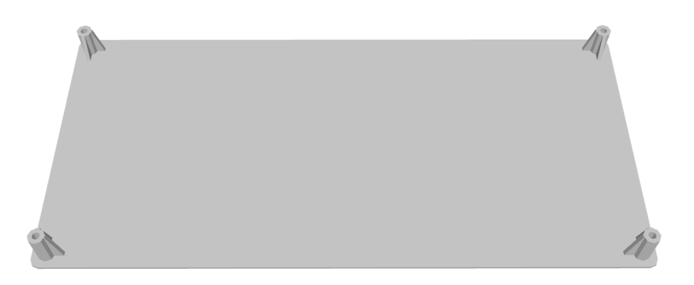
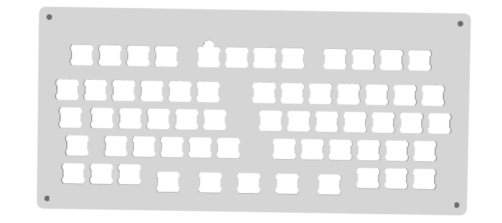

# aliceNS
This is a handwired alice-layout with no stable key, with low-budget.
Take inspiration from [fAuxLICE](https://github.com/brockar/fAuxLICE?tab=readme-ov-file) and ortholinical layout.
## Layout
## 3d plate/case
Shout out for open-source keyboard generetor [here](https://github.com/jeffminton/keyboard_stl_generator)
### Bottom plate

### Top plate

## Components
